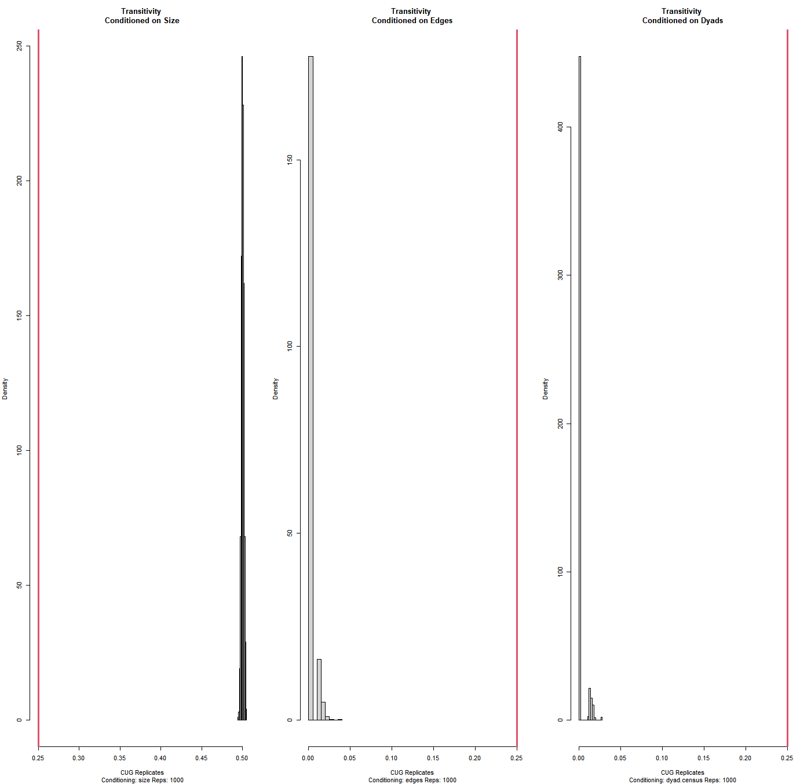
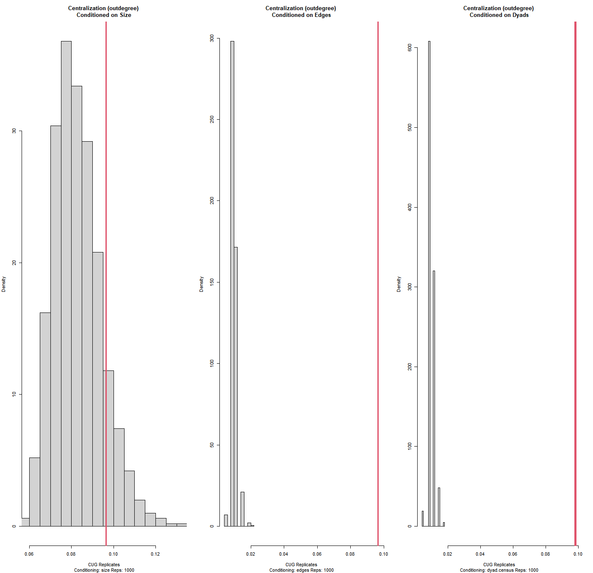

# Introduction

In the wake of Bolivia's 2019 general elections, the Organization of American States (OAS) claimed in its report that the socialist party of Evo Morales was rigging the election. As a result, protests from the opposing party erupted, eventually leading to a coup supported by the police and military. As a result, Jeanine Áñez of the opposition Democrat Social Movement, assumed the interim presidency of Bolivia. Evo Morales and other members of his party sought political asylum in Mexico citing concerns over their livelihood.

Months later, multiple studies analyzing the election results found no statistical evidence for fraud and also pointed out errors in the coding of OAS's report. With concerns of the OAS's history of being a US sponsored organization that was utilized to stop communism in Latin America during the cold war; many left-wing proponents believed that the US backed right-wing coup of Bolivia was a ploy to exploit the country's lithium reserves --- its deposits being the second largest in the world.

Earlier this year, Morales's party won the re-election by a landslide and ousted Jeanine Áñez's interim presidency that was marred by controversy and massacres. But concern over the US government's and US media's actions and influence still looms.

# Data

To analyze the network structure of this political crisis, 63,965 tweets were retrieved from the Academic Twitter API. Tweets were collected from the month of the 2019 crisis to the month before the 2020 election (09/10/2019 - 09/18/2020). The search query string only including tweets that matched two keywords from the following list: bolivia, coup, democracy, evo, morales, anez, jeanine.

The original data was in RDS format and converted into an edgelist representing the universe of cases. Data was transformed by only including tweets that mention another user in the dataframe column "mention_screen_name" with a minimum of 2 retweets. There are 5,539 nodes and what constitutes a node within this dataset is the original sender of a tweet. Ties are defined when a "sender" has a tweet mentioning another user. There are 6,986 ties and the ties are weighted by the count of retweets.

```{r setup, include=FALSE}
knitr::opts_chunk$set(warning = FALSE)
#READ IN
library(igraph)
library(dplyr)
library(tidyverse)
library(ggplot2)
library(kableExtra)
library(visNetwork)
library(scales)
library(intergraph)


tweetsxl <- read.csv("~/networks-blog/bolivianetworkfinal.csv")

mt <- graph_from_data_frame(tweetsxl, directed=TRUE) 
mt

mat <- as.matrix(tweetsxl, header=T)
mat

net <- asNetwork(mt)
net
```

# Descriptive Statistics

Many users are interconnected within this sparsely connected graph due to direct ties measuring mentions rather than retweets, meaning the authors had to mention the user within their tweet rather than simply retweeting. There are 966 total components with the main component having 3327 points whereas the minor component only contains 14. The network is fairly centralized (49%) with a small number of nodes representing the information flow, however the centralization score almost doubles when we focus on the main component. The low global transivity score showcases that there isn't a shared attribute (ideology, opinions, etc.) clustering nodes together when they're mentioning users in their tweets. This transitivity trend continues at the local level of the ego network (when users mention each other) even when the proportion of mutual connections is measured via reciprocity.

The average number of steps along the shortest paths of network nodes is 27.6, showing an extent of inefficiency in information. The distribution of degrees shows a lack of statistical dispersion, with the average user only having one link for both mentioning another twitter user or receiving a mention.

```{r echo=TRUE}
# DESCRIPTIVE STATS

vcount(mt)
ecount(mt)

graph.density(mt, loops = TRUE)

igraph::components(mt)$no
head(igraph::components(mt)$csize)


centr_degree(mt, mode = c("in"), loops = TRUE,normalized = TRUE)$centralization

maincomponent <- induced_subgraph(
  mt, V(mt)[components(mt)$membership == which.max(components(mt)$csize)]
)
centr_degree(maincomponent, mode = c("in"), loops = TRUE,normalized = TRUE)$centralization


transitivity(mt, type = "global")
transitivity(mt, type="average")

reciprocity(mt)

igraph::dyad.census(mt)
igraph::triad_census(mt) 

average.path.length(mt)
head(igraph::degree(mt))

# Degrees Histogram
mt.nodes <- data.frame(name=V(mt)$name, degree=igraph::degree(mt)) %>%
  arrange(desc(degree))


summary(mt.nodes)
hist(mt.nodes$degree, main="2019 Bolivian Political Crisis (Degrees)", xlab = "") 
# scale_fill_manual(values 

head(closeness(mt))

mt.nodes <- mt.nodes %>%
    mutate(indegree=igraph::degree(mt, mode="in", loops=TRUE),
           outdegree=igraph::degree(mt, mode="out", loops=TRUE))
summary(mt.nodes) %>% 
kbl() %>%
kable_material_dark(c("striped", "hover")) %>% 
scroll_box(width = "100%", height = "auto")
```

# Data Visualization

### The first graph shows the overall network graph, when a user mentions their own username.

```{r echo=TRUE}
#VIZ
kcore <- coreness(mt, mode="all") 
twocore <- induced_subgraph(mt, kcore>=1)

graph1 <- visIgraph(twocore,idToLabel = TRUE,layout = "layout_nicely") %>%
  visOptions(highlightNearest = TRUE, nodesIdSelection = TRUE) 
graph1

```

### Here kcore = 4, to identify a smaller subset of interconnected users that have at least 4 edges with other users in the core.

```{r echo=TRUE}
#VIZ 2
kcore4 <- coreness(mt, mode="all") 
fourcore <- induced_subgraph(mt, kcore4>=4)

graph2 <- visIgraph(fourcore,idToLabel = TRUE,layout = "layout_nicely") %>%
  visOptions(highlightNearest = TRUE, nodesIdSelection = TRUE)
graph2
```

### This visualization lowers kcore = 1 but focuses on the main component.

```{r echo=TRUE}
#comp viz

kcore1 <- coreness(maincomponent, mode="all") 
onecore <- induced_subgraph(maincomponent, kcore1>=1)

graph3 <- visIgraph(onecore,idToLabel = TRUE,layout = "layout_nicely") %>%
  visOptions(highlightNearest = TRUE, nodesIdSelection = TRUE) 
graph3
```

# Prominent Nodes

Measuring popularity/status with in/out degree centrality made the most sense for this dataset due to it being directed and is simply looking at mentions of usernames. The ousted president Evo Morales (evoespueblo) received the most mentions by twitter users followed by La Razón, one of the largest newspaper publications within Bolivia.

```{r echo=TRUE}
indegree_mt <- sort(degree(mt,mode = "in"),decreasing = TRUE)
indegree_mt[1:10] %>% #show the top 10 users ranked by in-degree 
kbl() %>%
kable_material_dark(c("striped", "hover")) %>% 
scroll_box(width = "100%", height = "auto")
```

### And below we see the users who most mentioned other users, finding a mix of journalists, supporters, and opponents of Evo Morales.

```{r echo=TRUE}
outdegree_mt <- sort(degree(mt,mode = "out"),decreasing = TRUE)
outdegree_mt[1:10] %>% #show the top 10 users ranked by out-degree
kbl() %>%
kable_material_dark(c("striped", "hover")) %>% 
scroll_box(width = "100%", height = "auto")
```

### Below are users who acted as a bridge between the other nodes within the network by measuring betweenness centrality.

```{r echo=TRUE}
# BETWEENESS 
bt <- sort(betweenness(mt, directed=T), decreasing = TRUE)
bt[1:10] %>%  #show the top 10 nodes by betweenness centrality 
kbl() %>%
kable_material_dark(c("striped", "hover")) %>% 
scroll_box(width = "100%", height = "auto")
```

### Using Google's PageRank algorithm we can find the biggest influencers in this network through the ranks of search results.

```{r echo=TRUE}
pr <- page_rank(mt, algo = c("prpack"))
pr <- sort(pr$vector,decreasing = TRUE)
pr[1:10] %>% #show the top 10 users ranked by PageRank
kbl() %>%
kable_material_dark(c("striped", "hover")) %>% 
scroll_box(width = "100%", height = "auto")
```

### Total measures of popularity/status

```{r echo=TRUE}
# NODES
degree.nodes<-data.frame(name=V(mt)$name,
         totdegree=igraph::degree(mt, loops = TRUE), 
         indegree=igraph::degree(mt, loops = TRUE), 
         outdegree=igraph::degree(mt,loops = TRUE),
          eigen <- centr_eigen(mt, directed=T),
         bt)

arrange(degree.nodes, desc(indegree)) %>%
  head() %>% 
kbl() %>%
kable_material_dark(c("striped", "hover")) %>% 
scroll_box(width = "100%", height = "auto")
```

# Communities

To discover communities, the walktrap community detection method was used due to it handling weights, increasing the probability of it going towards its direction. Below is a visualization of the communities color coded by the walktrap method.

```{r echo=TRUE}
# COMMUNITY

#mt.eb <- cluster_edge_betweenness(mt) 

mt.wt <- walktrap.community(mt, weights = TRUE)
membership(mt.wt)[1:20]   #list only 10 nodes.


rt <- mt
V(rt)$color <- membership(mt.wt)

kcorewt <- coreness(rt, mode="all") 
twocorewt <- induced_subgraph(rt, kcorewt>=2)

graph4 <- visIgraph(twocorewt,idToLabel = TRUE,layout = "layout_nicely") %>%
  visOptions(highlightNearest = TRUE, nodesIdSelection = TRUE) 
graph4
```

# Inferential Statistics

By conditioning the transitivity (clustering) of the network on size, density, and dyads. We find that in 1,000 random networks, the variable number of nodes is able to produce a greater value than the observed graph's transitivity.



This network graph has a low centralization score. Below it will be evaluated on indegree and outdegree vertices and conditioned on the variables size, density, and dyads. We find that in 1,000 random networks, none of the variables above were able to produce a value higher than the observed centralization score when based on indegree. However, the variable number of nodes was able to produce a greater value when evaluating for outdegrees.



