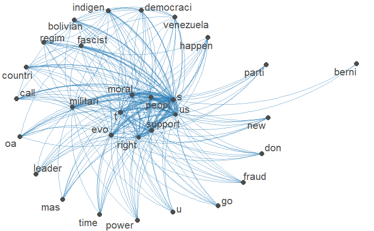
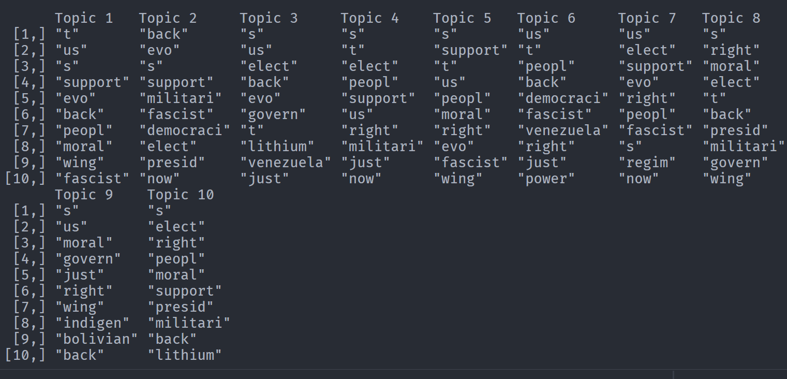

```{r}
library(jsonlite)
library(dplyr)
library(sentimentr)
library(tidyverse)
library(readr)
library(tm)
library(syuzhet)
library(tidytext)
library(ggplot2)
library(quanteda)
library(topicmodels)
library("quanteda.textplots")
```

Trying out topic modeling, I had to just insert images due to the git file going over the 100mb limit.

```{r}
tweets <- readRDS("~/networks-blog/boliviatweetsfile")
tweets <- iconv(tweets$text, to = "ASCII", sub = " ")
tweets <- gsub("(RT|via)((?:\\b\\W*@\\w+)+)", "", tweets)  # Remove the "RT" (retweet) and usernames 
tweets = gsub("http.+ |http.+$", " ", tweets)  # Remove html links
tweets = gsub("http[[:alnum:]]*", "", tweets)
tweets = gsub("[[:punct:]]", " ", tweets)  # Remove punctuation
tweets = gsub("[ |\t]{2,}", " ", tweets)  # Remove tabs
tweets = gsub("^ ", "", tweets)  # Leading blanks
tweets = gsub(" $", "", tweets)  # Lagging blanks
tweets = gsub(" +", " ", tweets) # General spaces 
```

```{r}
tweets = tolower(tweets)
tweets = unique(tweets)
corpus <- Corpus(VectorSource(tweets))
corpus <- tm_map(corpus, removeWords, stopwords("english"))  
corpus <- tm_map(corpus, removeNumbers)

corpus <- tm_map(corpus, stemDocument)
corpus = tm_map(corpus, removeWords, c("amp", "will", "get", "can", "like", "say", "know"))
```

```{r}
twtdfmstop <- tokens(as.character(corpus), 
                 remove_punct = TRUE, 
                 remove_url = TRUE, 
                 remove_numbers = TRUE,
                 remove_separators = TRUE,
                 verbose = TRUE)

tweetdfm <- dfm(tokens(twtdfmstop))

tweetdfm <- tweetdfm %>%
            dfm_remove("english") %>% 
            dfm_remove(c("bolivia", "coup"))
```

# Co-Occurence Matrix

`twtdfmstop2 <- dfm_remove(tweetdfm, c("can", "get", "know", "#", "@", "now", "like")) smaller_dfm <- dfm_trim(twtdfmstop2, min_termfreq = 100)`

# `create fcm from dfm`

`smaller_fcm <- fcm(smaller_dfm)`

`myFeatures <- names(topfeatures(smaller_fcm, 30))`

# `retain only those top features as part of our matrix`

`even_smaller_fcm <- fcm_select(smaller_fcm, pattern = myFeatures, selection = "keep")`

# `check dimensions`

`dim(even_smaller_fcm)`

# `compute size weight for vertices in network`

`size <- log(colSums(even_smaller_fcm))`

# `create plot`

`set.seed(100) textplot_network(even_smaller_fcm, vertex_size = size / max(size) * 3)`



# Topic Modeling

`lda <- LDA(tweetdfm, k = 10)`

`term <- terms(lda, 10) term`


